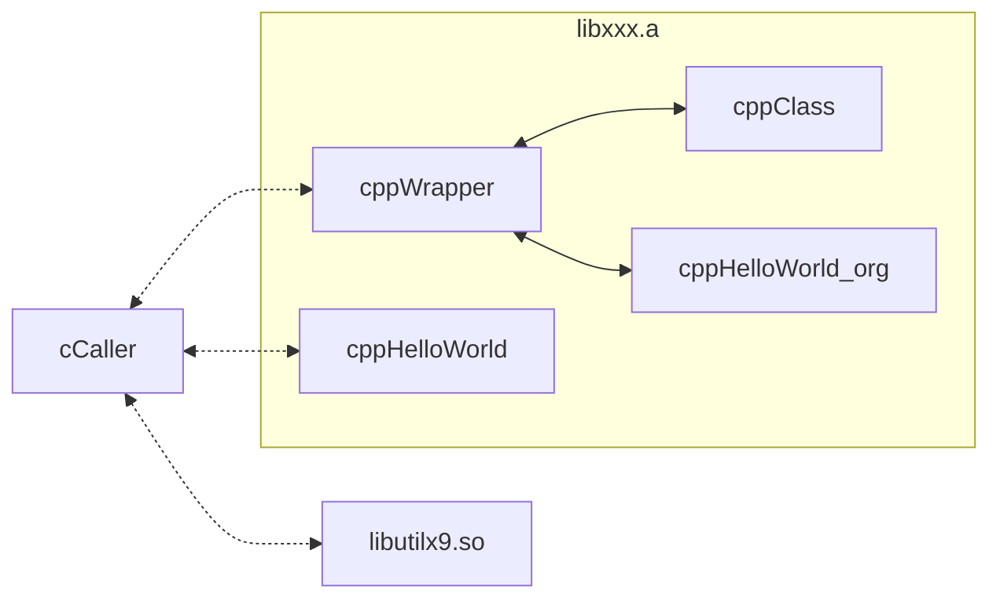
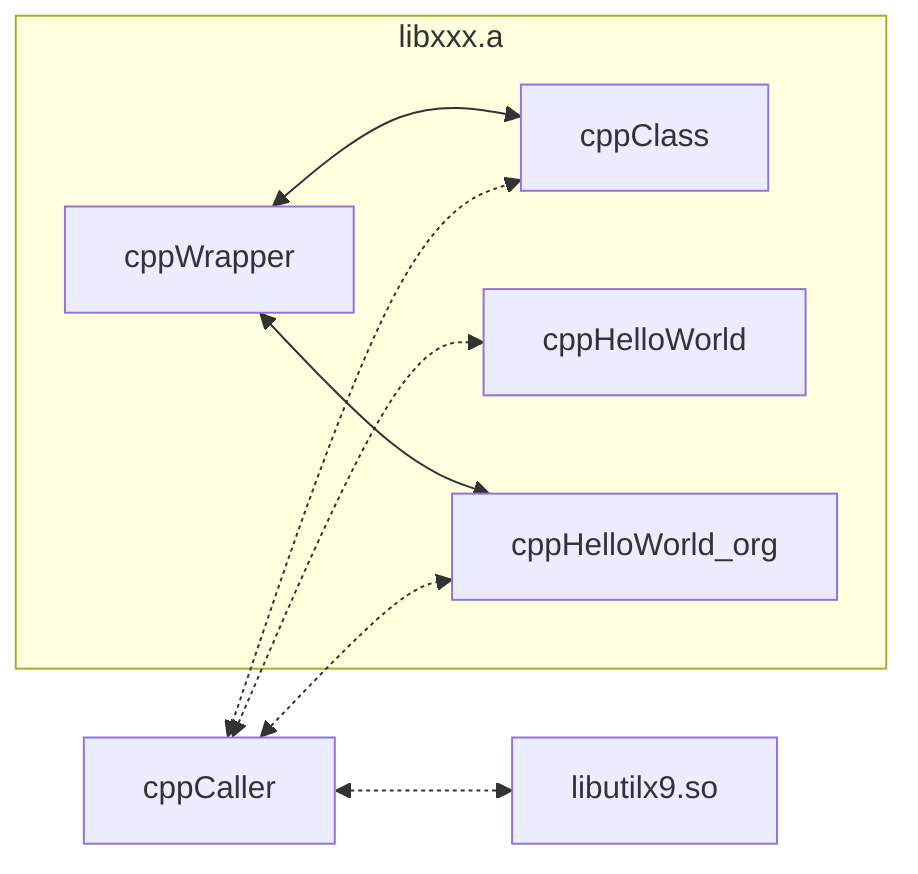
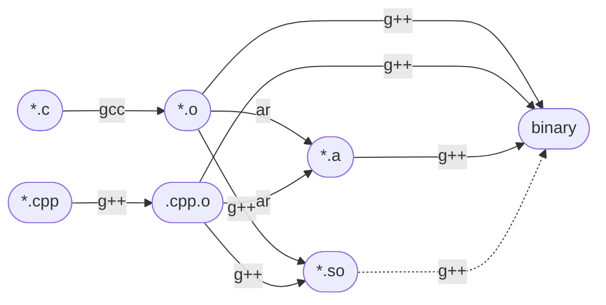

# 1. Overview

> CvsCPPmixer gives an example how to mix C and C++.




# 2. Depend on
#### - [utilx9](https://github.com/lankahsu520/utilx9)

# 3. Current Status


# 4. Build
```bash
$ cd /work/codebase/lankahsu520/utilx9
$ . confs/simple_x86.conf
$ make; make install
$ export LD_LIBRARY_PATH=`pwd`:$LD_LIBRARY_PATH

$ cd /work/codebase/lankahsu520/CvsCPPmixer
$ make
```
# 5. Example or Usage
#### - cCaller - c all cpp
```bash
$ ./cCaller
[343717/343717] app_loop:56 - (pid: 0)
[cppHelloWorld] Hello world - CPP !!!
[cppHelloWorld_org] Hello world - CPP !!!
[cppClass] My membername is lanka.
[343717/343717] app_loop:75 - (cksum: 1398)
[343717/343717] app_loop:77 - (cksum: 22044)
[343717/343717] main:181 - Bye-Bye !!!
```

#### - cppCaller - cpp call c
```bash
$ ./cppCaller
[cppHelloWorld] Hello world - CPP !!!
[cppHelloWorld_org] Hello world - CPP !!!
[cppClass] My m_name is lanka.
[108082/108082] main:99 - (cksum: 1398)
[108082/108082] main:101 - (cksum: 22044)
[108082/108082] main:110 - (num: 123, &num: 0x7ffd50d3e28c)
[108082/108082] poniter_learning:72 - (x: 123 0x7ffd50d3e23c)
[108082/108082] poniter_learning:75 - (rx: 123 0x7ffd50d3e23c)
[108082/108082] poniter_learning:77 - (pnum: 123 0x7ffd50d3e28c)
[108082/108082] poniter_learning:79 - (rnum: 123 0x7ffd50d3e28c)
[108082/108083] thread_handler:43 - (count: 0)
[108082/108083] thread_handler:50 - (name: thread_A, count: 1)
[108082/108083] thread_handler:50 - (name: thread_A, count: 2)
[108082/108083] thread_handler:53 - wait 3 seconds ...
[108082/108083] thread_handler:50 - (name: thread_A, count: 3)
[108082/108083] thread_handler:50 - (name: thread_A, count: 4)
[108082/108083] thread_handler:50 - (name: thread_A, count: 5)
[108082/108083] thread_handler:53 - wait 3 seconds ...
[108082/108083] thread_handler:65 - Bye-Bye !!!
[108082/108082] main:120 - Bye-Bye !!!

```

# 6. License
> CvsCPPmixer is under the New BSD License (BSD-3-Clause).

# 7. Documentation



# Appendix

# I. Study
- [Mixing C and C++ Code in the Same Program](https://www.oracle.com/technical-resources/articles/it-infrastructure/mixing-c-and-cplusplus.html)
- ~~[How to mix C and C++](https://isocpp.org/wiki/faq/mixing-c-and-cpp)~~
- [make - 8.3 Functions for File Names](https://www.gnu.org/software/make/manual/html_node/File-Name-Functions.html)
- [C 呼叫 C++ 函式的方法](http://www.huoschen.idv.tw/blog/programming/c-calling-c++-functions/)
- [name mangling](https://zh.wikipedia.org/zh-tw/名字修饰)
- [C++项目文件组织一般形式](https://www.ansicheng.com/cpp/cpp-project-file-hierarchy-form)

# II. Debug
