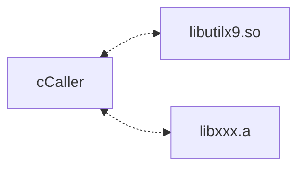
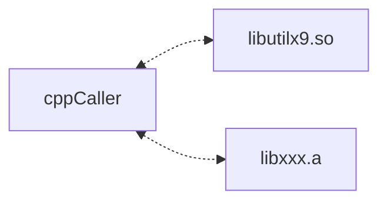

# 1. Overview

CvsCPPmixer gives an example how to mix C and C++.




# 2. Depend on
- [utilx9](https://github.com/lankahsu520/utilx9)

# 3. Current Status


# 4. Build
```bash
$ make
```
# 5. Example or Usage
- cppCaller -
```bash
$ ./cCaller
[83069/83069] app_loop:48 - (pid: 0)
Hello world - CPP !!!
[83069/83069] app_loop:54 - (cksum: 1398)
[83069/83069] app_loop:56 - (cksum: 22044)
[83069/83069] main:160 - Bye-Bye !!!
```

- cppCaller -
```bash
$ ./cppCaller
./cppCaller
Hello world - CPP !!!
[83089/83089] main:16 - (cksum: 1398)
[83089/83089] main:18 - (cksum: 22044)
```

# 6. License
CvsCPPmixer is under the New BSD License (BSD-3-Clause).


# 7. Documentation
Run an example and read it.

# Appendix

# I. Study
- [Mixing C and C++ Code in the Same Program](https://www.oracle.com/technical-resources/articles/it-infrastructure/mixing-c-and-cplusplus.html)
- [How to mix C and C++](https://isocpp.org/wiki/faq/mixing-c-and-cpp)

# II. Debug
