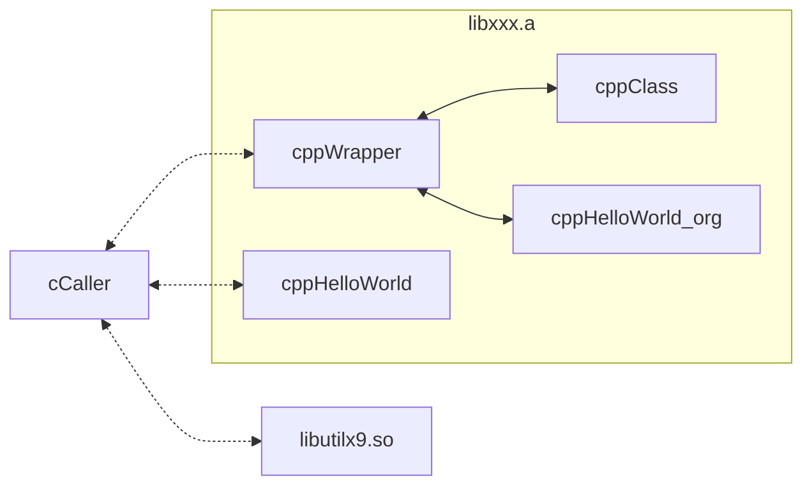
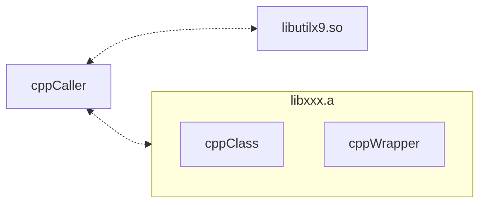

# 1. Overview

CvsCPPmixer gives an example how to mix C and C++.




# 2. Depend on
- [utilx9](https://github.com/lankahsu520/utilx9)

# 3. Current Status


# 4. Build
```bash
$ make
```
# 5. Example or Usage
- cCaller -
```bash
$ ./cCaller
[343717/343717] app_loop:56 - (pid: 0)
[cppHelloWorld] Hello world - CPP !!!
[cppHelloWorld_org] Hello world - CPP !!!
[cppClass] My membername is lanka.
[343717/343717] app_loop:75 - (cksum: 1398)
[343717/343717] app_loop:77 - (cksum: 22044)
[343717/343717] main:181 - Bye-Bye !!!
```

- cppCaller -
```bash
$ ./cppCaller
[cppHelloWorld] Hello world - CPP !!!
[cppHelloWorld_org] Hello world - CPP !!!
[cppClass] My membername is lanka.
[343715/343715] main:86 - (cksum: 1398)
[343715/343715] main:88 - (cksum: 22044)
[343715/343716] thread_handler:43 - (count: 0)
[343715/343716] thread_handler:50 - (name: thread_A, count: 1)
[343715/343716] thread_handler:50 - (name: thread_A, count: 2)
[343715/343716] thread_handler:53 - wait 3 seconds ...
[343715/343716] thread_handler:50 - (name: thread_A, count: 3)
[343715/343716] thread_handler:50 - (name: thread_A, count: 4)
[343715/343716] thread_handler:50 - (name: thread_A, count: 5)
[343715/343716] thread_handler:53 - wait 3 seconds ...
[343715/343716] thread_handler:65 - Bye-Bye !!!
[343715/343715] main:101 - Bye-Bye !!!
```

# 6. License
CvsCPPmixer is under the New BSD License (BSD-3-Clause).


# 7. Documentation
Run an example and read it.

# Appendix

# I. Study
- [Mixing C and C++ Code in the Same Program](https://www.oracle.com/technical-resources/articles/it-infrastructure/mixing-c-and-cplusplus.html)
- [How to mix C and C++](https://isocpp.org/wiki/faq/mixing-c-and-cpp)
- [make - 8.3 Functions for File Names](https://www.gnu.org/software/make/manual/html_node/File-Name-Functions.html)
- [C 呼叫 C++ 函式的方法](http://www.huoschen.idv.tw/blog/programming/c-calling-c++-functions/)

# II. Debug
